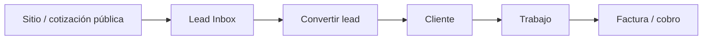

# Pipeline CRM (FieldBase)

Flujo canónico para no perder leads ni duplicar clientes.

## Pasos

1. **Captura** — `estimate_requests`, `contractor_website_leads`, formulario `/site/[slug]/contact`
2. **Bandeja** — `/lead-inbox` → `GET /api/lead-inbox`
3. **Conversión** — solo `POST /api/lead-inbox/convert` crea/actualiza `clients`
4. **Operación** — `/clients`, `/jobs`, `/invoices`
5. **Cobro** — checkout Stripe, webhooks `/api/payments/webhooks/stripe`

## APIs por módulo

| Módulo | Rutas UI | API |
|--------|----------|-----|
| Presales | lead-inbox, estimates | `lead-inbox`, `estimates`, `estimate-builder` |
| Core | clients, jobs, calendar | `clients`, `jobs`, `appointments` |
| Revenue | invoices | `invoices`, `revenue-dashboard` |
| Plataforma | `/owner/*` | `platform/*`, `admin/*` (legacy) |

## Deprecaciones

- `GET/POST /api/supabase/clients` → usar `/api/clients`
- `GET /api/admin/overview` → preferir `/api/platform/overview` (+ métricas contractor en admin overview legacy)

Código compartido: `@/lib/crm`
