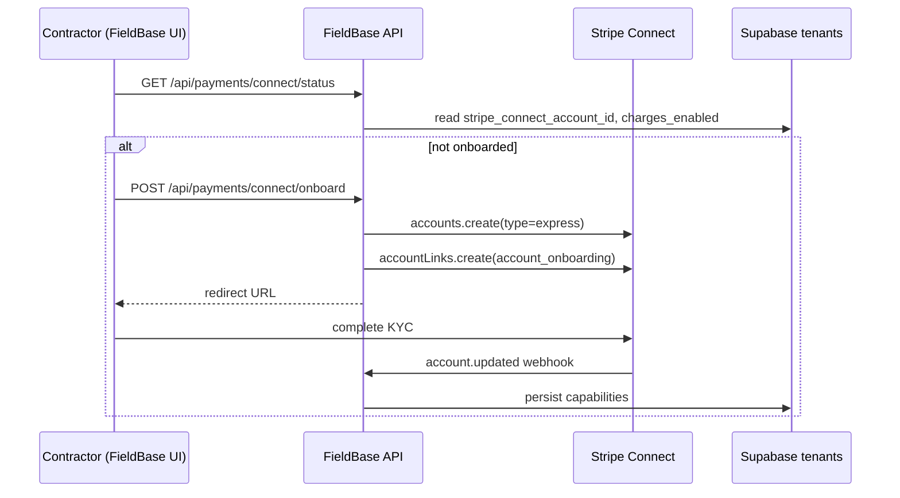
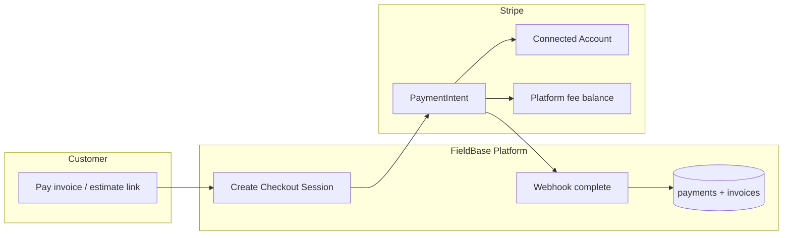
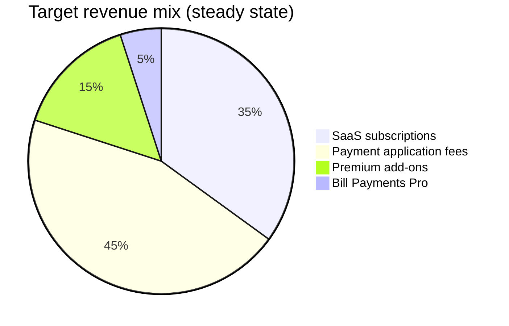

# FieldBase Payments & Payout Architecture

**Status:** Phase 1 audit + recommendation (May 2026)  
**Production:** https://fieldbaseapp.net  
**Scope:** Customer → contractor payments, FieldBase SaaS revenue, contractor payouts, Bill Payments (outbound) as a separate product lane.

---

## Executive summary

FieldBase today runs **platform-owned Stripe** (single `STRIPE_SECRET_KEY`) for invoice/estimate checkout and SaaS subscriptions. **Stripe Connect is not implemented.** Customer card payments for invoices land in the **FieldBase platform Stripe balance**, not in connected contractor accounts. There is **no automated contractor payout pipeline**, **no payout dashboard**, and **no application-fee / transfer split** on checkout sessions.

**Recommended architecture: Option C (hybrid) — implemented in phases**

| Phase | Model | Purpose |
|-------|--------|---------|
| **Now → v1** | **Connect Express (destination charges)** for all *customer → contractor* payments | Contractors onboard to Stripe; funds settle to their connected account; FieldBase collects `application_fee_amount` per payment. |
| **Parallel** | **Platform Stripe customer** (existing) for *contractor → FieldBase* SaaS & Bill Payments Pro | Subscriptions and bill-pay funding stay on the platform account (already built). |
| **Later** | **Marketplace / separate charges + transfers** | Multi-party splits, subcontractors, escrow-like holds — only when product requires it. |

**Why not pure Option A or B alone?**

- **Option A only (direct Connect, no platform layer):** Good for payouts but weak for unified SaaS + bill-pay + future marketplace controls unless you still operate a platform account.
- **Option B only (platform holds all funds, manual payouts):** Highest regulatory/ops burden, slower contractor trust, poor scale for 1099/KYC distribution.
- **Option C:** Matches Stripe’s documented pattern for SaaS + embedded payments: **Express accounts** for recipients, **platform account** for your own billing, **application fees** for monetization.

**Three bullets for leadership**

1. **Turn on Stripe Connect Express** so invoice/estimate/public checkout money goes to contractors with automatic payouts and clear KYC — stop settling customer job payments only on the platform balance.
2. **Keep SaaS + Bill Payments** on the existing platform customer/subscription stack; add explicit **application fees** on contractor checkouts as the primary payment revenue lever.
3. **Fix P0 data/webhook gaps** (payment status enum, `contractor_id` column, webhook idempotency, public pay links) before marketing “get paid online.”

---

## Current-state audit (codebase)

### What exists and works (partially)

| Area | Implementation | Key paths |
|------|----------------|-----------|
| Invoice Stripe Checkout | Creates Checkout Session on **platform** account; pending row in `payments`; webhook marks paid | `src/lib/stripe-payments.js` → `createStripeCheckoutSessionForAccess`, `src/app/api/invoices/[id]/checkout/route.js` |
| Estimate → invoice → checkout | Creates invoice from estimate, then same checkout helper | `src/app/api/estimate-builder/[id]/checkout/route.js` |
| Invoice email with pay link | Sends email with checkout URL | `src/app/api/invoices/[id]/send/route.js` |
| Stripe webhooks | Signature verify; checkout session + subscription + bill-pay PI events | `src/app/api/payments/webhooks/stripe/route.js`, `src/lib/stripe-webhook-processing.js` |
| Async webhooks | Inngest idempotency on `stripeEventId` when `INNGEST_EVENT_KEY` set | `src/app/api/inngest/[...route]/route.js` |
| SaaS subscriptions | `contractor_subscriptions`, plans, trial, portal | `src/lib/stripe-payments.js` (`createContractorSubscription`), `src/app/api/subscriptions/*` |
| Bill Payments (outbound) | Contractors pay **their** bills via platform Stripe + Plaid; remittance workflow | `src/lib/bill-payments.js`, `docs/BILL_PAYMENTS_SECURITY.md` |
| Payment setup health | Publishable key, webhook URL, APP_URL checks | `src/app/api/invoices/payment-setup-status/route.js` |
| Revenue dashboard | RPC over `payments` table (tenant-scoped) | `src/app/api/revenue-dashboard/route.js` |
| Tenant isolation | Invoice access checks, webhook metadata validation | `requireInvoicePaymentAccess`, `requireWebhookPaymentResources` in `stripe-payments.js` |

### What is missing or broken (gaps)

| Gap | Severity | Detail |
|-----|----------|--------|
| **No Stripe Connect** | P0 | Zero `transfer_data`, `application_fee_amount`, `on_behalf_of`, Account Links, or `stripe_account_id` on tenants. |
| **Customer payments → platform balance** | P0 | Contractors are not paid via Stripe automatically; platform must manually transfer (not implemented). |
| **No contractor payout UI/API** | P0 | No balance, payout schedule, or Connect onboarding screens. |
| **`payments.status` enum mismatch** | P0 | DB check: `pending, completed, failed, expired, canceled`. App/webhooks use **`paid`**. Webhook updates can fail constraint. |
| **`payments.contractor_id` column missing** | P0 | Code inserts/filters `contractor_id`; migrations only define `tenant_id`. |
| **Manual invoice payments API disabled** | P1 | `POST /api/invoices/[id]/payments` returns **405**; UI still offers cash/check registration. |
| **No public unauthenticated checkout** | P1 | Checkout creation requires authenticated contractor session; email links work but no tokenized public pay page. |
| **Website lead → no payment** | P2 | Leads/requests don't create checkout (by design today). |
| **Public quote pay** | P2 | `/api/public/quotes/[token]` — approval flow; no Stripe checkout for deposit. |
| **Refunds / disputes** | P1 | No webhook handlers for `charge.refunded`, `charge.dispute.*`, no refund API. |
| **Receipts** | P1 | No Stripe receipt_email / Customer email automation beyond invoice send template. |
| **Connect onboarding env** | P0 | `STRIPE_CONNECT_CLIENT_ID` / Connect settings not documented in app env. |
| **Platform fee on invoice checkout** | P1 | No application fee on sessions. |
| **Subscription products** | P2 | Creates new Stripe Product per subscription instead of fixed Price IDs. |
| **Tax** | P2 | No Stripe Tax; invoice tax fields mostly static. |

### Security & compliance (current)

**Strengths**

- Webhook signature verification (`constructEvent`).
- Metadata cross-checks: tenant, invoice, job, client on checkout completion.
- Session amount vs pending payment row validation.
- Idempotent skip when status + session already processed.
- Bill Payments: CSRF, rate limits, tenant RLS (see `docs/BILL_PAYMENTS_SECURITY.md`).
- Sensitive invoice routes gated by `canManageSensitive`.

**Weaknesses**

- No persistent **Stripe event id** deduplication when Inngest is off (duplicate webhooks could double-apply if skip logic doesn't match).
- Platform holds contractor funds without ledger / payout obligation tracking.
- No PCI scope reduction beyond Checkout (good) but no Connect capability audit trail per tenant.

---

## Architecture options

### Option A — Direct contractor Stripe (Connect only)

Each contractor connects Express/Standard account. All customer checkouts use **destination charges** or **direct charges** with application fee.

- **Pros:** Automatic payouts, Stripe handles KYC, clear money path, scalable.
- **Cons:** Requires Connect onboarding UX, support for restricted accounts, separate platform billing account still needed for SaaS.

### Option B — Platform-controlled, manual payouts

All charges on platform; FieldBase pays contractors via Transfer/Payout on schedule.

- **Pros:** Maximum control in early MVP.
- **Cons:** Money transmitter perception, ops-heavy, weak contractor trust, reconciliation burden.

### Option C — Hybrid (recommended)

| Money flow | Stripe account | Mechanism |
|------------|----------------|-----------|
| Customer pays invoice/estimate | **Connected Express** | Checkout `payment_intent_data.transfer_data.destination` + `application_fee_amount` |
| Contractor pays FieldBase SaaS | **Platform** | Customer + Subscription (existing) |
| Contractor funds bill pay | **Platform** | PaymentIntent with `metadata.source=bill_payment` (existing) |
| Future marketplace split | **Connect** | Separate charges & transfers or multi-recipient |

---

## Recommended Stripe Connect design

### Account type: **Express**

| Type | Verdict |
|------|---------|
| **Express** | **Default for contractors** — Stripe-hosted onboarding, dashboard for tax docs, fast to ship, fits “contractors in trucks” UX. |
| Standard | More control for power users; heavier onboarding; defer until requested. |
| Custom | Avoid unless full fintech team; highest compliance burden. |

### Onboarding flow (target)



### Customer checkout (target)



**Checkout session fields (destination charge pattern):**

```javascript
payment_intent_data: {
  application_fee_amount: platformFeeCents,
  transfer_data: { destination: connectedAccountId },
  on_behalf_of: connectedAccountId, // optional branding
  statement_descriptor_suffix: contractorDescriptor,
}
```

### Payout timing

| Setting | Recommendation |
|---------|----------------|
| Express default | **Stripe automatic daily rolling payouts** to contractor bank (after hold period). |
| Platform fee | Lands on platform balance immediately with charge. |
| First payout | Communicate Stripe’s initial hold (typically 7–14 days for new accounts). |

### Fee structure proposal

| Revenue line | Model | Suggested default |
|--------------|--------|-------------------|
| **SaaS** | Flat monthly subscription | Keep **Contractor Pro ~$35/mo** (existing); Bill Payments Pro separate plan |
| **Payment processing** | % + fixed per successful card charge | **0.5%–1.0% application fee** on invoice/estimate volume (on top of Stripe’s 2.9%+$0.30 paid by contractor or pass-through — **product decision**) |
| **Premium** | Website, AI, leads | Feature flags / higher tiers (existing direction) |
| **Bill Payments** | Subscription + optional platform fee on remittance | Already has `bill_payment_platform_fees` table |

**Pass-through vs absorb:** For trust, show contractors **“Stripe processing ~2.9% + FieldBase 0.75%”** on checkout settings. Default: **application_fee** taken from charge (contractor net = total - Stripe - FieldBase).

---

## Webhook event matrix

| Event | Today | Target |
|-------|-------|--------|
| `checkout.session.completed` | Invoice payments | Keep + idempotency |
| `checkout.session.async_payment_*` | Invoice | Keep |
| `checkout.session.expired` | Marks expired | Keep |
| `payment_intent.*` (bill_payment metadata) | Bill pay | Keep separate path |
| `customer.subscription.*` | SaaS | Keep |
| `invoice.payment_succeeded/failed` | Subscription invoices table | Keep |
| `account.updated` | — | **Add** — sync Connect capabilities |
| `account.application.deauthorized` | — | **Add** — disable payouts |
| `charge.refunded` | — | **Add** — reverse payment row |
| `charge.dispute.created/closed` | — | **Add** — flag invoice + notify |
| `payout.paid/failed` | — | **Add** — contractor payout dashboard |

**Endpoint:** `POST /api/payments/webhooks/stripe`  
**Connect webhooks:** Enable “Connect” events on same endpoint or dedicated `connect` secret (Stripe recommends separate endpoint for Connect — optional P1).

---

## Policies (refunds, disputes, failures)

| Scenario | Policy |
|----------|--------|
| **Failed card** | Checkout remains unpaid; `payments.status=failed`; notify contractor via in-app alert (P1). |
| **Partial payments** | Already supported via balance_due; multiple checkout sessions need unique pending rows (existing). |
| **Refund** | Contractor-initiated from FieldBase → Stripe Refund API on connected charge; webhook sets payment `refunded`, recalculates invoice (P1). |
| **Dispute** | Webhook freezes narrative; contractor notified; platform fee may be clawed back per Stripe rules. |
| **Subscription failed** | Existing `invoice.payment_failed` → `subscription_invoices`; extend to dunning email (P2). |

---

## FieldBase revenue model (scalable)



1. **Core SaaS** — CRM, estimates, scheduling (current trial + monthly).
2. **Take rate** — Small % on customer payments (Connect application fee).
3. **Add-ons** — Website builder, AI, lead tools (feature flags / tiers).
4. **Bill Payments** — Separate subscription; do not conflate with *receiving* job payments.

---

## Dashboard UX (target)

| Screen | Purpose | Status |
|--------|---------|--------|
| **Payments overview** | Volume, fees, net, failed count | Partial (`/dashboard` revenue RPC) |
| **Connect onboarding** | Status, continue onboarding | **Missing** |
| **Payouts** | Stripe Express payout history | **Missing** |
| **Transactions** | Per-invoice payment rows | Partial (`payments` table) |
| **Invoice tracking** | Paid / partial / overdue | Exists on `/invoices` |
| **Subscription** | `/subscriptions` | Exists |
| **Alerts** | Failed payment, dispute, Connect restricted | **Missing** |

---

## Future scalability hooks

Design DB and APIs now (no full build):

- `tenant_payment_settings` — `stripe_connect_account_id`, `charges_enabled`, `payouts_enabled`, `default_fee_bps`, `descriptor`
- `payment_splits` — for marketplace / subcontractor % (nullable until needed)
- `escrow_holds` — optional status on `payments` (`held`, `released`)
- Team members — same Connect account per business or multiple connected accounts under org (P3)

---

## Environment variables

### Existing (platform)

| Variable | Purpose |
|----------|---------|
| `STRIPE_SECRET_KEY` | Platform secret |
| `NEXT_PUBLIC_STRIPE_PUBLISHABLE_KEY` | Client |
| `STRIPE_WEBHOOK_SECRET` | Webhook signing |
| `PUBLIC_BILLING_NAME` | Statement descriptor suffix |

### Add for Connect (Phase 2)

| Variable | Purpose |
|----------|---------|
| `STRIPE_CONNECT_CLIENT_ID` | OAuth / Connect settings (if using OAuth; Express often uses account links only) |
| `STRIPE_CONNECT_WEBHOOK_SECRET` | Optional separate Connect endpoint |
| `FIELDBASE_PLATFORM_FEE_BPS` | Default application fee (e.g. `75` = 0.75%) |
| `FIELDBASE_PLATFORM_FEE_FIXED_CENTS` | Optional fixed fee per charge |

---

## Phased implementation roadmap

### Phase 0 — Hardening (1 week) — **in progress / partial**

- [x] Document architecture (this file)
- [x] Migration file: `payments.status` includes `paid`; add `contractor_id` (apply to prod)
- [x] `stripe_webhook_events` idempotency table (migration file)
- [x] Scaffold Connect status/onboard routes (feature-flagged)
- [x] Re-enable manual payment recording API (`POST /api/invoices/[id]/payments`)
- [x] CI security-preflight: `STRIPE_WEBHOOK_SECRET` dummy for health check

### Phase 1 — Connect Express MVP (2–3 weeks)

- Stripe Dashboard: enable Connect, branding, fee settings
- Set `STRIPE_CONNECT_ENABLED=true` in production when approved
- Tenant onboarding + `account.updated` webhook
- [x] Destination charges on invoice checkout (when Connect flag on + onboarded)
- Contractor “Payments” settings page (connect + test mode)
- Public pay link token (optional scoped checkout without contractor login)

### Phase 2 — Operations (2 weeks)

- Refund API + webhooks
- Dispute notifications
- Payout list (Stripe API proxy)
- Failed payment alerts
- Receipt emails (Stripe or Resend)

### Phase 3 — Growth (4+ weeks)

- Public quote deposit checkout
- Website request → deposit optional
- Stripe Tax / 1099-K communications
- Marketplace splits prototype

---

## Do not implement yet (requires product/legal approval)

1. **Production Connect go-live** without Stripe Connect application review and updated Terms (money flow disclosure).
2. **Holding customer funds** on platform balance intentionally (Option B).
3. **Automatic platform-initiated payouts** to contractors outside Stripe Connect.
4. **1099-K / tax advice** in UI — link to Stripe Express tax docs only.
5. **Increasing application fees** without in-app fee disclosure at onboarding.

---

## Blockers

| Blocker | Owner |
|---------|--------|
| Stripe Connect not enabled on Stripe Dashboard | Ops |
| Legal copy for “payments processed by Stripe on behalf of [Contractor]” | Legal/product |
| `gh` auth for PR merge | DevOps |
| Confirm production DB has diverged schema vs migrations (`contractor_id`, `paid` status) | Run migration audit on Supabase |

---

## File reference index

```
src/lib/stripe-payments.js          # Checkout, subscriptions, customers
src/lib/stripe-webhook-processing.js
src/app/api/payments/webhooks/stripe/route.js
src/app/api/invoices/[id]/checkout/route.js
src/app/api/invoices/[id]/send/route.js
src/app/api/invoices/[id]/payments/route.js   # currently 405
src/app/api/estimate-builder/[id]/checkout/route.js
src/app/api/subscriptions/{create,current,cancel,portal,invoices}/route.js
src/lib/bill-payments.js                      # Outbound bill pay (separate)
src/app/api/bill-payments/pay/route.js
supabase/migrations/20260418170000_create_payments_table_and_secure_stripe.sql
supabase/migrations/20260508140000_create_contractor_subscriptions.sql
```

---

*Last updated: audit pass May 2026. Implementation PRs should reference this doc and update the gap tables when closed.*
