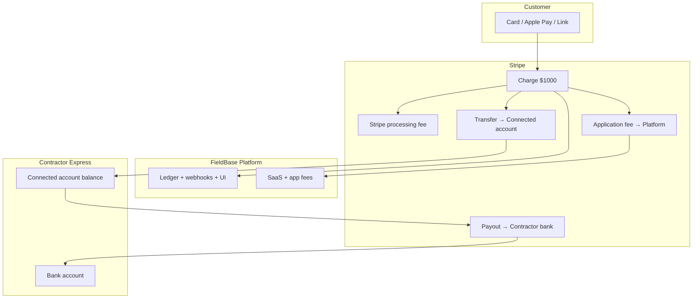

# FieldBase — Money Flow, Monetization & Production Plan

**Status:** Business logic & architecture planning (no implementation in this doc)  
**Companion:** [`payments-architecture.md`](./payments-architecture.md) (technical audit + Connect scaffold)  
**Audience:** Product, engineering, finance, legal  
**Last updated:** May 2026

---

## 1. Executive recommendation

**Adopt Option C (hybrid) with Stripe Connect Express + destination charges + application fees**, while keeping the **platform Stripe account** for SaaS subscriptions and Bill Payments (outbound).

| Lane | Stripe account | Pattern |
|------|----------------|---------|
| Customer → contractor (invoice, estimate, payment link, future website deposit) | **Connected Express** | Checkout `payment_intent_data.transfer_data.destination` + `application_fee_amount` |
| Contractor → FieldBase (CRM SaaS) | **Platform** | `Customer` + `Subscription` (existing) |
| Contractor → pay their bills (Bill Payments) | **Platform** | `PaymentIntent` + remittance (existing, separate product) |

**Why not pure platform-hold (Option B)?** FieldBase would become the merchant of record for every job payment — higher compliance risk, manual payout ops, weak contractor trust, poor scale past ~100 active contractors.

**Why not Connect-only (Option A)?** You still need a platform account for SaaS and bill-pay; hybrid is Stripe’s standard SaaS + embedded payments model.

**Why Express (not Standard/Custom)?** Fastest KYC onboarding for contractors in trucks; Stripe-hosted onboarding and tax forms; good mobile UX; sufficient for thousands of contractors until enterprise asks for Standard.

---

## 2. Current-state audit (codebase, May 2026)

### 2.1 What works today

| Capability | How it works | Key code |
|------------|--------------|----------|
| Invoice Checkout | Platform `checkout.sessions.create`, pending row in `payments`, webhook marks paid | `src/lib/stripe-payments.js`, `api/invoices/[id]/checkout` |
| Estimate → invoice → pay | Same checkout helper | `api/estimate-builder/[id]/checkout` |
| Pay link in email | Contractor sends invoice email with checkout URL | `api/invoices/[id]/send` |
| Webhooks | Signature verify; checkout + subscription + bill-pay PI | `api/payments/webhooks/stripe`, `stripe-webhook-processing.js` |
| SaaS billing | `contractor_subscriptions`, trial, portal | `api/subscriptions/*`, `createContractorSubscription` |
| Bill Payments | Contractors fund bill pay on **platform** account (not job revenue) | `src/lib/bill-payments.js` |
| Tenant scoping | Invoice access + webhook metadata validation | `requireInvoicePaymentAccess`, metadata checks |
| Connect scaffold | Feature-flagged; not live | `src/lib/stripe-connect.js`, migration `20260523100000_*` |

### 2.2 Critical gaps (production blockers)

| Gap | Impact |
|-----|--------|
| **No Connect on checkout** | 100% of card job payments settle on **FieldBase platform balance** |
| **No contractor payout automation** | Contractors are not paid via Stripe Connect today |
| **Manual cash/check API disabled** | `POST /api/invoices/[id]/payments` returns **405**; UI may still offer manual entry |
| **No public tokenized pay page** | Checkout creation requires authenticated contractor session |
| **Refunds / disputes** | No handlers for `charge.refunded`, `charge.dispute.*` |
| **Schema drift risk** | App uses `paid` + `contractor_id`; older migration only had `completed` — fix in `20260523100000_payments_hardening_connect_prep.sql` (apply to prod) |
| **Website / quote → pay** | Leads only; no deposit checkout |

### 2.3 Database (payments-related)

| Table | Role |
|-------|------|
| `payments` | Per-invoice payment attempts (Stripe + future manual) |
| `invoices` | Balance, status, `stripe_session_id` |
| `contractor_subscriptions` | SaaS plan per tenant |
| `subscription_plans` / `subscription_invoices` | SaaS billing history |
| `company_profiles` | Connect fields (scaffold): `stripe_connect_account_id`, capabilities |
| `stripe_webhook_events` | Idempotency when Inngest off |
| `bill_*` tables | Outbound bill pay — **do not merge** with job payment ledger |

---

## 3. Target money flow (three parties)



### 3.1 Step-by-step (target state)

1. **Customer** opens invoice link / estimate checkout / future public pay URL.
2. **FieldBase API** verifies tenant, invoice balance, Connect `charges_enabled`, creates `payments` row `pending`.
3. **Stripe Checkout** creates PaymentIntent with `transfer_data.destination` = contractor Express account + `application_fee_amount` = FieldBase fee.
4. **Customer pays** — card data never touches FieldBase servers (PCI SAQ A).
5. **Stripe** settles: platform fee to FieldBase balance; remainder to connected account (minus Stripe processing fees per Connect pricing).
6. **Webhook** `checkout.session.completed` → idempotent update → `payments.status=paid`, invoice `balance_due` reduced.
7. **Stripe** schedules **automatic payout** from connected account to contractor bank (default rolling daily; first-time accounts may have 7–14 day hold).
8. **FieldBase** shows transaction in contractor Payments dashboard (Stripe API / Connect embedded components later).

### 3.2 Where money lands first

| Model | First landing | FieldBase today | Target |
|-------|---------------|-----------------|--------|
| Job payment (card) | Platform or Connected | **Platform only** | **Connected** (destination charge) |
| SaaS subscription | Platform | Platform | Platform |
| Bill payment | Platform | Platform | Platform |

---

## 4. Worked example: customer pays **$1,000.00**

Assumptions (US, card-not-present, standard Stripe pricing — **verify live rates in Stripe Dashboard**):

- Invoice total: **$1,000.00**
- FieldBase application fee: **0.75%** = **$7.50** (configurable via `FIELDBASE_PLATFORM_FEE_BPS=75`)
- Stripe processing (illustrative): **2.9% + $0.30** = **$29.30**
- Connect: **destination charge**, Stripe fee typically assessed on connected account portion (standard Connect behavior)

### 4.1 Successful payment (T+0)

| Line item | Amount | Who receives / pays |
|-----------|--------|---------------------|
| Customer charged | $1,000.00 | Customer card |
| Stripe processing fee | −$29.30 | Usually deducted from contractor’s portion |
| FieldBase application fee | −$7.50 | FieldBase platform Stripe balance |
| **Contractor net (connected balance)** | **~$963.20** | Contractor Express account |

**Timing**

| Event | Typical timing |
|-------|----------------|
| Charge succeeds | Immediate |
| Application fee available on platform | Immediate (with charge) |
| Funds in connected account balance | Immediate (may be pending) |
| Payout to contractor bank | Rolling (e.g. 2 business days US); **new accounts: longer first payout** |
| FieldBase DB updated | Seconds (webhook) |

### 4.2 Partial payment / deposit / milestone

Already supported in data model via `balance_due` and multiple `payments` rows:

| Scenario | Behavior |
|----------|----------|
| **Deposit 30%** | Checkout for $300; remaining $700 later |
| **Milestone 1 / 2** | Separate invoices or line items; each checkout session = new `payments` row |
| **Progress billing** | Multiple pending rows; never exceed `balance_due` (enforced in `createStripeCheckoutSessionForAccess`) |

**Product rule:** Each checkout must have unique `paymentId` (already uses `crypto.randomUUID()` + idempotency key).

### 4.3 Failed payment

| Stage | System behavior |
|-------|-----------------|
| Card declined | Checkout incomplete; `payments` stays `pending` or `failed` |
| Async methods | `checkout.session.async_payment_failed` → mark failed, notify contractor |
| Customer retry | New session or same session per Stripe rules |

**Contractor UX:** Alert on dashboard; invoice remains unpaid.

### 4.4 Full refund ($1,000)

| Party | Effect |
|-------|--------|
| Customer | +$1,000 back to card (5–10 business days typical) |
| Contractor connected balance | −$963.20 (approx net) |
| FieldBase application fee | **Clawed back** — Stripe reverses application fee on full refund |
| Stripe fee | Processing fee **not** returned to merchant (industry standard) |

**FieldBase ledger:** `payments.status=refunded`; invoice `balance_due` recomputed; audit log entry.

**Implementation:** Refund API on connected charge + `charge.refunded` webhook (Phase 2).

### 4.5 Chargeback / dispute

| Stage | Money | Liability |
|-------|-------|-----------|
| Dispute opened | Stripe may debit connected account or platform per dispute rules | Contractor is **merchant of record** on Express for destination charges |
| Evidence window | FieldBase notifies contractor; link to Stripe Express dispute UI | |
| Lost dispute | Funds withdrawn + dispute fee (~$15) | Contractor bears loss; platform fee already reversed |

**FieldBase role:** Software + notifications; **not** tax or legal advisor — Terms must state contractor responsibility.

### 4.6 SaaS subscription (separate from $1,000 job payment)

Example: **Contractor Pro $35/mo** on platform account:

| Item | Amount |
|------|--------|
| Contractor pays FieldBase | $35.00 + tax if enabled later |
| Stripe fee on $35 | ~$1.32 |
| FieldBase net | ~$33.68 |

No Connect involved — clear separation prevents accounting confusion.

---

## 5. Revenue model recommendation

### 5.1 Revenue streams (steady state target mix)

| Stream | Model | Suggested default | Notes |
|--------|--------|-------------------|-------|
| **Core SaaS** | Monthly subscription | $29–$49/mo (tiered) | CRM, estimates, scheduling — existing trial |
| **Payment take rate** | Application fee % (+ optional fixed) | **0.5%–1.0%** per successful job charge | Primary scale lever with GMV |
| **Bill Payments Pro** | Separate subscription | Existing plans | Outbound bills ≠ inbound job pay |
| **Premium add-ons** | Website, AI, leads | $10–$30/mo bundles | Feature flags |
| **Lead / website upgrades** | Usage or tier | Future | Optional |

### 5.2 Fee pass-through policy (product decision)

| Policy | Contractor sees | FieldBase risk |
|--------|-----------------|----------------|
| **A — Contractor pays all fees** (recommended default) | “Customer paid $1,000; you receive ~$963 after Stripe + FieldBase” | Low |
| **B — FieldBase absorbs Stripe** | Simpler quote | Erodes margin on small tickets |
| **C — Customer pays surcharge** | Illegal/restricted in some states — legal review | High |

**Recommendation:** Policy **A** with transparent fee breakdown in Payments settings and invoice send preview.

### 5.3 Comparison to alternatives

| Model | Pros | Cons |
|-------|------|------|
| SaaS only | Simple | Caps revenue; no alignment with GMV |
| SaaS + take rate | Scales with success; industry standard (Shopify, Square) | Requires Connect + trust |
| Interchange-plus markup | Transparent to large contractors | Complex UX |
| Bill pay cross-subsidy | Uses existing rail | Confuses “getting paid” vs “paying bills” |

---

## 6. Architecture options (pros / cons)

### Option A — Connect direct (contractor is MoR for job pay)

- **Pros:** Automatic payouts, Stripe KYC, clear tax docs in Express, scalable to thousands of contractors.
- **Cons:** Onboarding UX required; support for `restricted` accounts; application fee disclosure.

### Option B — Platform holds all funds

- **Pros:** Short-term control.
- **Cons:** Money transmitter scrutiny, manual payouts, reconciliation nightmare, contractor distrust — **reject for production**.

### Option C — Hybrid (recommended)

- **Pros:** Best of A for job pay + existing platform billing for SaaS/bill-pay; one Stripe platform with Connect enabled.
- **Cons:** Two mental models for support team — mitigate with clear UI labels (“Job payments” vs “Subscription” vs “Bill pay”).

### Connect account type

| Type | Use |
|------|-----|
| **Express** | **Default** — all contractors |
| Standard | Optional later for high-volume businesses wanting full Stripe Dashboard |
| Custom | Avoid unless dedicated fintech/compliance team |

### Charge type

| Type | Verdict |
|------|---------|
| **Destination charge** | **Default** — single checkout, automatic transfer + app fee |
| Separate charge and transfer | Defer for marketplace multi-split |
| Direct charge | Defer — contractor statement descriptor only |

---

## 7. Contractor onboarding (KYC)

| Step | Owner | Detail |
|------|-------|--------|
| 1 | FieldBase UI | “Connect payouts” CTA on Payments settings |
| 2 | API | `POST /api/payments/connect/onboard` → Account Link (scaffold exists) |
| 3 | Stripe | Identity, bank account, sometimes SSN/EIN |
| 4 | Webhook | `account.updated` → `charges_enabled`, `payouts_enabled` in `company_profiles` |
| 5 | Gating | Block **new** card checkouts until `charges_enabled` (allow manual cash with audit) |

**Instant vs standard payouts:** Express supports instant payout (fee ~1%) — product toggle Phase 3; default automatic daily.

---

## 8. Manual payments (cash / check / Zelle / Venmo)

| Today | Target |
|-------|--------|
| API **405** | Re-enable `POST` with `provider: manual`, `method: cash\|check\|zelle\|other` |
| No Stripe fee | No application fee |
| Risk | Contractor self-reports — mark invoice paid offline |

**Ledger:** Same `payments` table, `provider=manual`, `status=paid`, `metadata.method`, `recorded_by_user_id`, optional `proof_url`.

**No PCI** — no card data.

---

## 9. Multi-tenant payment isolation

| Layer | Mechanism |
|-------|-----------|
| API | `getAuthenticatedTenantContext` + `requireInvoicePaymentAccess` |
| Checkout metadata | `tenantId`, `invoiceId`, `paymentId` cross-check on webhook |
| Connect | One Express account per `company_profiles.tenant_id` |
| DB | RLS on tenant-scoped tables; `payments.contractor_id` / `tenant_id` indexes |
| Webhooks | Reject if metadata tenant ≠ payment row tenant |

**Scale:** Stripe Connect supports many connected accounts per platform; shard webhook processing with idempotency table + queue (Inngest already optional).

---

## 10. Security, fraud, PCI

| Topic | FieldBase approach |
|-------|-------------------|
| **PCI** | Stripe Checkout / Elements — **SAQ A**; never store PAN/CVC |
| **Webhooks** | HMAC verify `STRIPE_WEBHOOK_SECRET`; idempotency `stripe_webhook_events` |
| **Fraud** | Stripe Radar (default); optional 3DS for high tickets; velocity limits on checkout create |
| **Connect fraud** | Monitor `account.updated` restrictions; disable payouts on deauth |
| **Secrets** | Server-only `STRIPE_SECRET_KEY`; publishable key client-only |
| **CSRF** | Session cookie routes; bill-pay has extra guards |
| **Audit** | `security_audit` / payment mutation logs for manual entries |

**CI note:** Production startup requires `STRIPE_WEBHOOK_SECRET` — security preflight must inject dummy secret for health check.

---

## 11. Webhook architecture (production scale)

```
Stripe → POST /api/payments/webhooks/stripe
         → verify signature
         → claimStripeWebhookEvent (DB idempotency)
         → route by event.type
         → update payments / invoices / subscriptions / company_profiles
         → optional Inngest fan-out for retries
```

| Event | Priority |
|-------|----------|
| `checkout.session.completed` | P0 |
| `checkout.session.expired` | P0 |
| `account.updated` | P0 (Connect) |
| `charge.refunded` | P1 |
| `charge.dispute.*` | P1 |
| `payout.paid/failed` | P2 (dashboard) |
| `invoice.payment_failed` (SaaS) | P1 |

**Scale:** At millions of volume, add dedicated Connect webhook endpoint + worker concurrency limits + dead-letter queue.

---

## 12. Taxes & liability (non-legal summary)

| Topic | Guidance |
|-------|----------|
| **Sales tax on services** | Contractor’s obligation in most US service cases; Stripe Tax optional Phase 3 |
| **1099-K** | Stripe issues to contractors via Express for applicable thresholds |
| **Platform 1099** | FieldBase reports SaaS + application fee income separately |
| **Liability** | Terms: FieldBase is software; contractor is seller; Stripe is payments processor |
| **Insurance** | Consider E&O; not payment guarantor |

**Action:** Legal review of Terms + payment disclosure before Connect go-live.

---

## 13. Required DB schema changes (phased)

### Phase 0 (migration exists — apply to prod)

- `payments.status` includes `paid`, `refunded`, `disputed`
- `payments.contractor_id`
- `stripe_webhook_events`
- `company_profiles.stripe_connect_*`

### Phase 1 — Connect MVP

```sql
-- Illustrative; implement in named migration when approved
alter table company_profiles add column if not exists
  stripe_connect_payout_schedule text default 'standard',
  platform_fee_bps int default 75,
  platform_fee_fixed_cents int default 0;

alter table payments add column if not exists
  stripe_connect_account_id text,
  application_fee_cents int,
  stripe_fee_cents int,
  net_to_contractor_cents int,
  payment_method_type text, -- card, manual, etc.
  manual_method text;

create table payment_disputes (
  id uuid primary key,
  payment_id uuid references payments(id),
  tenant_id uuid not null,
  stripe_dispute_id text unique,
  status text,
  amount_cents int,
  created_at timestamptz default now()
);
```

### Phase 2 — Operations

- `payment_refunds` audit table
- `tenant_payment_settings` (fee overrides, descriptors)
- `payment_splits` (nullable, marketplace future)

---

## 14. Environment variables

| Variable | Required | Purpose |
|----------|----------|---------|
| `STRIPE_SECRET_KEY` | Yes | Platform API |
| `NEXT_PUBLIC_STRIPE_PUBLISHABLE_KEY` | Yes | Client |
| `STRIPE_WEBHOOK_SECRET` | Yes | Webhook verify |
| `STRIPE_CONNECT_ENABLED` | Phase 1 | Feature flag |
| `FIELDBASE_PLATFORM_FEE_BPS` | Phase 1 | Default 75 = 0.75% |
| `FIELDBASE_PLATFORM_FEE_FIXED_CENTS` | Optional | e.g. 30¢ |
| `STRIPE_CONNECT_WEBHOOK_SECRET` | Optional | Separate Connect endpoint |
| `PUBLIC_BILLING_NAME` | Yes | Descriptor suffix |

**CI / preflight:** `STRIPE_WEBHOOK_SECRET=whsec_ci_dummy_...` for `next start` health checks.

---

## 15. Risk analysis

| Risk | Severity | Mitigation |
|------|----------|------------|
| Platform holds contractor job funds | **Critical** (today) | Ship Connect destination charges |
| Schema `paid` vs `completed` | **High** | Apply migration `20260523100000` |
| Double webhook apply | **Medium** | `stripe_webhook_events` + Inngest |
| Manual payment UI without API | **Medium** | Re-enable API or remove UI |
| Dispute loss on contractor | **Medium** | Education + Express dashboard link |
| Stripe Connect application rejected | **High** | Early Stripe review, clean website/terms |
| Fee transparency complaints | **Medium** | Onboarding fee calculator |
| Bill pay confused with job pay | **Low** | Separate nav + copy |

---

## 16. Production rollout phases

### Phase 0 — Hardening (1 week)

- [ ] Apply `20260523100000_payments_hardening_connect_prep.sql` to production
- [ ] Fix CI `STRIPE_WEBHOOK_SECRET` in security-preflight workflow
- [ ] Re-enable manual payment API **or** remove UI
- [ ] Verify webhook idempotency in prod (table exists)

### Phase 1 — Connect Express MVP (2–3 weeks)

- [ ] Stripe Dashboard: enable Connect, complete platform profile
- [ ] Legal: payment flow disclosure in Terms
- [ ] `STRIPE_CONNECT_ENABLED=true` in production
- [ ] Destination charges on invoice/estimate checkout
- [ ] Contractor Payments settings (status + onboarding link)
- [ ] Block card checkout if not onboarded (allow manual)

### Phase 2 — Operations (2 weeks)

- [ ] Refunds + `charge.refunded`
- [ ] Dispute webhooks + notifications
- [ ] Payout history UI (Stripe API)
- [ ] Failed payment alerts
- [ ] Public pay-by-token URL

### Phase 3 — Growth (4+ weeks)

- [ ] Quote/website deposits
- [ ] Milestone templates UX
- [ ] Stripe Tax evaluation
- [ ] Instant payout toggle
- [ ] `payment_splits` prototype

### Phase 4 — Marketplace (future)

- [ ] Multi-recipient transfers
- [ ] Escrow / hold statuses
- [ ] Commission rules engine

---

## 17. Missing compliance & security items

| Item | Owner | Status |
|------|-------|--------|
| Stripe Connect platform agreement | Ops/Legal | Pending |
| Terms: contractor as seller, FieldBase as software | Legal | Pending |
| Privacy: payment data processors | Legal | Partial |
| SOC2 / PCI attestation | Ops | Stripe handles card data |
| Money transmission analysis | Legal | Mitigated by Connect MoR model |
| Refund policy in UI | Product | Missing |
| Fee disclosure at onboarding | Product | Missing |
| 1099 communication | Product | Link to Stripe Express |

---

## 18. Implementation roadmap (engineering)

| # | Work item | Depends on | Est. |
|---|-----------|------------|------|
| 1 | Prod migration payments hardening | — | 1d |
| 2 | CI env `STRIPE_WEBHOOK_SECRET` | — | 0.5d |
| 3 | Connect onboard + status UI | Stripe Connect enabled | 3d |
| 4 | Checkout: `transfer_data` + `application_fee_amount` | #3 | 3d |
| 5 | Gate checkout on `charges_enabled` | #3 | 1d |
| 6 | Manual payments API | Product approval | 2d |
| 7 | Refund API + webhook | #4 | 3d |
| 8 | Dispute webhooks | #4 | 2d |
| 9 | Payout dashboard | #4 | 3d |
| 10 | Public pay token | #4 | 3d |
| 11 | Payments analytics page | #4 | 5d |

**Do not start #4–11 until legal + Stripe Connect platform approval.**

---

## 19. Architecture decision record (ADR summary)

**Decision:** Stripe Connect Express + destination charges + application fees + separate platform billing for SaaS and Bill Payments.

**Status:** Proposed — implementation gated on Phase 0 hardening + legal.

**Consequences:**

- Contractors see payouts in Stripe Express; FieldBase shows read-only/synced status.
- FieldBase revenue scales with GMV via application fees.
- Engineering must maintain two payment mental models in UX copy and support playbooks.

---

## 20. Quick reference — today vs target

| Question | Today | Target |
|----------|-------|--------|
| Client pays how? | Stripe Checkout link | Same + public token |
| Money lands first? | **FieldBase platform** | **Contractor Connect** |
| Contractor payout? | Manual/off-platform | Stripe automatic |
| FieldBase earns? | SaaS (+ bill pay fees) | SaaS + **application fee** |
| Stripe fee on $1k? | Platform pays ~$29 | Contractor ~$29 (typical) |
| FieldBase fee on $1k? | $0 | **~$7.50** (0.75%) |
| Refund? | Manual | Stripe Refund API |
| Cash job? | Broken API | `provider=manual` |

---

*This document is planning-only. Implementation PRs must reference [`payments-architecture.md`](./payments-architecture.md) and update gap tables when shipped.*
