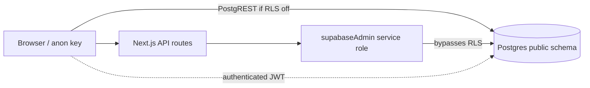

# Supabase RLS Security Audit — May 2026

**Trigger:** Supabase security advisor reported a public-schema table with Row Level Security (RLS) disabled.

**Scope:** All `public` tables; emphasis on estimates, invoices, quotes, approvals, signatures, and customer data.

**Architecture note:** Production API routes use `supabaseAdmin` (service role), which **bypasses RLS**. RLS is still required because the browser holds `NEXT_PUBLIC_SUPABASE_PUBLISHABLE_KEY` — a motivated caller can hit PostgREST directly unless tables are locked down.

---

## Executive summary

| Severity | Finding | Status |
|----------|---------|--------|
| **Critical** | `company_profiles` uses `tenant_id text` and was skipped by uuid-only RBAC migrations → full public read/write if RLS off | **Fixed** in `20260627100000_harden_public_schema_rls_gaps.sql` |
| **High** | `contractor_website_domains` created without RLS (hostname → tenant routing, verification tokens) | **Fixed** (same migration) |
| **Medium** | Legacy `payment_methods` / `autopay_schedules` tables may exist without RLS | **Fixed** (RLS on, no permissive policies) |
| **Low** | `estimate_revisions` has RLS but zero policies (service-role-only by design) | **OK** — intentional |
| **Info** | Public flows (leads, estimate requests, published websites) use explicit `anon` INSERT policies | **OK** — reviewed |

---

## How access works today



- **Contractors:** Session cookie + API routes; tenant scoping in route handlers + (when using client Supabase) RLS via `is_tenant_member` / `can_access_tenant`.
- **Customers (public):** Token-gated API routes (`/api/estimates/:id/public`, `/api/public/quotes/:token`); **not** direct table access.
- **Admins / super_admin:** API routes; some RLS policies include `super_admin` JWT bypass.

---

## Affected tables (confirmed gaps)

### 1. `company_profiles` — **Critical exposure risk**

| Attribute | Detail |
|-----------|--------|
| **Why exposed** | `tenant_id` is `text` (PK). Migrations in `20260416120000_create_profiles_and_rbac.sql` only attach policies when `tenant_id` is `uuid`, so this table was skipped. |
| **Data at risk** | Company name, address, logo, signature threshold, Stripe Connect account id (if column present), tax settings |
| **App usage** | `supabaseAdmin` only (`company-profile-store.js`, branding, signature policy) |
| **Anonymous risk** | Without RLS: **anyone with the anon key could SELECT/UPDATE all tenants' profiles** |

**Fix:** Enable RLS + FORCE; tenant-scoped policies via `is_tenant_member(tenant_id)`; admin delete; super_admin read/write bypass.

### 2. `contractor_website_domains` — **High exposure risk**

| Attribute | Detail |
|-----------|--------|
| **Why exposed** | Table added in `20260522100000_website_media_and_domains.sql` with no RLS stanza |
| **Data at risk** | Custom hostnames, verification tokens, tenant ↔ slug mapping |
| **App usage** | `supabaseAdmin` only (`public-website-domains.js`) |
| **Anonymous risk** | Without RLS: enumeration of domains and verification tokens |

**Fix:** Enable RLS + FORCE; authenticated tenant-scoped CRUD; no public policy (resolution stays on server).

### 3. `payment_methods` / `autopay_schedules` (legacy) — **Medium**

| Attribute | Detail |
|-----------|--------|
| **Why exposed** | Created in `20260419180000_create_bill_payments_system.sql` without RLS; superseded by `bill_payment_methods` |
| **Fix** | RLS enabled, no permissive policies → service role only |

---

## Workflow-critical tables (estimates / invoices / signatures)

These tables are targeted by multiple historical migrations (`20260418105000`, `20260412233000`, `20260418130000`, etc.). In a healthy production DB they should already have RLS + policies.

The new migration includes a **safety net**: if any of the following still have **RLS disabled** or **zero policies**, baseline tenant policies are added **without dropping** existing policies:

| Table | Expected protection | Public / anon access |
|-------|---------------------|----------------------|
| `estimates` | `can_access_tenant(tenant_id)` or tenant+owner guards | None |
| `estimate_builder` | Same (uuid `tenant_id` after `20260417093000`) | None |
| `estimate_revisions` | RLS on, **no policies** (API-only) | None |
| `quotes` | Tenant + owner / member guards | None (public uses `quote_token` via API) |
| `contracts` | Tenant + owner guards | None |
| `invoices` | Tenant select; admin write (sensitive) | None |
| `clients`, `jobs`, `payments` | Tenant-scoped | None |
| `email_campaigns`, `email_logs`, `email_inbound` | `is_tenant_member(tenant_id)` (text) if policies missing | None |

**Signature data** lives inside `estimates.notes` (JSON audit blob), not a separate table — protecting `estimates` protects signatures.

**Customer PII:** `clients`, `estimates`, `quotes`, `contractor_website_leads`, `estimate_requests` — all tenant-scoped; public insert only where explicitly intended (leads / estimate requests).

---

## Tables with intentional public / anon policies

| Table | Policy | Purpose |
|-------|--------|---------|
| `contractor_websites` | Public read published sites | Marketing sites |
| `contractor_website_leads` | Public insert | Lead capture forms |
| `estimate_requests` | Public insert + tenant select | Website estimate request funnel |
| `subscription_plans` | Read all authenticated | Plan catalog |

Do **not** remove these without replacing the public API flow.

---

## Service-role-only tables (RLS on, no user policies)

| Table | Notes |
|-------|--------|
| `estimate_revisions` | Append-only history; API enforces tenant |
| `audit_logs`, `legal_versions`, `legal_acceptance` | Service policies |
| `stripe_webhook_events` | Webhook processor only |
| `platform_feature_flags` | Service role |
| `auth_rate_limits` | Service role |

---

## Policies added / fixed (migration `20260627100000`)

1. **`company_profiles`** — `company_profiles_tenant_{select,insert,update,delete}` (+ super_admin bypass on read/write).
2. **`contractor_website_domains`** — `contractor_website_domains_tenant_{select,insert,update,delete}`.
3. **Legacy bill tables** — RLS forced, no anon/authenticated policies.
4. **Safety net** — For 12 critical tables: enable RLS if missing; add `*_rls_gap_*` policies only when policy count = 0.

**Not changed:** Existing policy names on tables that already had RLS (no mass `DROP POLICY`).

---

## Verification checklist (staging / production)

Run in Supabase SQL Editor after applying the migration:

```sql
-- Tables in public schema WITHOUT RLS (should return zero rows)
select c.relname as table_name
from pg_class c
join pg_namespace n on n.oid = c.relnamespace
where n.nspname = 'public'
  and c.relkind = 'r'
  and not c.relrowsecurity
  and c.relname not like 'pg_%'
order by 1;

-- Workflow tables with RLS enabled but NO policies (expect only estimate_revisions)
select t.tablename
from pg_tables t
where t.schemaname = 'public'
  and t.tablename in (
    'estimates','estimate_builder','quotes','invoices','clients',
    'company_profiles','contractor_website_domains'
  )
  and exists (
    select 1 from pg_class c
    join pg_namespace n on n.oid = c.relnamespace
    where n.nspname = 'public' and c.relname = t.tablename and c.relrowsecurity
  )
  and not exists (
    select 1 from pg_policies p
    where p.schemaname = 'public' and p.tablename = t.tablename
  );
```

**App smoke tests (no behavior change expected for API routes):**

- [ ] Login as contractor → settings / company profile save
- [ ] Estimates list, PATCH, public respond link
- [ ] Invoice list + create
- [ ] Website builder custom domain save
- [ ] Public website lead form + estimate request
- [ ] Owner/super_admin dashboards

---

## Remaining security concerns

1. **Defense in depth vs. service role:** API routes must continue to scope by `tenantDbId`; RLS does not protect against a leaked **service role** key.
2. **JWT `tenant_id` claim:** `is_tenant_member` trusts JWT/profile alignment — compromised JWT could cross tenants if claims are wrong (mitigated by server-side session in this app).
3. **`company_profiles` public branding:** Public estimate pages load branding via API, not direct table access — OK after RLS fix.
4. **Storage buckets** (logos, website media): separate from table RLS — review bucket policies separately.
5. **Periodic re-audit:** New migrations that `CREATE TABLE` without an RLS block should trigger advisor review; consider a CI check on migration files.

---

## Apply instructions

```bash
# Local / staging
npm run db:migrate

# Or paste supabase/migrations/20260627100000_harden_public_schema_rls_gaps.sql
# into Supabase Dashboard → SQL Editor on production after staging validation.
```

**Branch:** Apply on `chore/estimate-workflow-hardening-may-2026` or a dedicated `security/rls-hardening-may-2026` branch before production.

---

*Generated: May 2026 — Madrid App / FieldBase estimate workflow hardening pass.*
